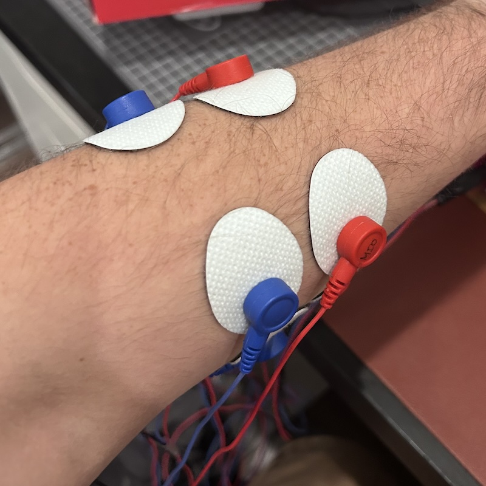
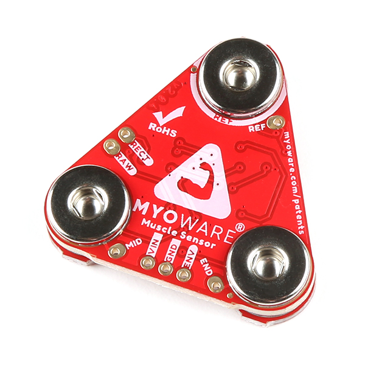
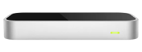
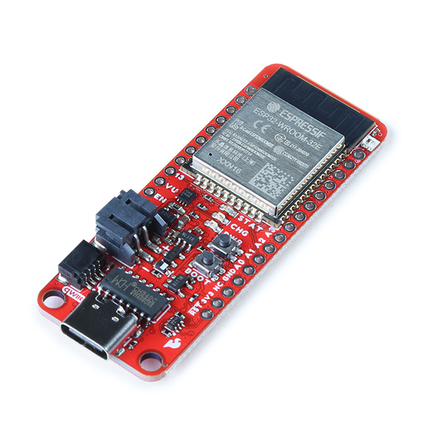

## 1. Motivation & Objective

<!--**What are you trying to do and why? (plain English without jargon)**-->

Extended reality (XR) has recently driven innovation in human computer
interfaces, especially in measuring the position of the fingers on a hand.
Usually this fine-grained finger position tracking is done with computer vision
as in the Meta Quest 3 [[4](#10-references)]. However, vision-based finger tracking relies
on the hand being in view of the camera. As a result, alternative finger
posetracking have been proposed such as wristpressure [[5](#10-references)],
bioimpedence [[6](#10-references)], and mmWave technology [[7](#10-references)]. One of the
most promising technologies is surface Electromyography (sEMG) that has even
been demoed in Meta's recent Orion augmented reality (AR) glasses anouncement
that included a sEMG wristband to track certain gestures [[3](#10-references)]. 

This project will attempt to create an open source framework to measure the
position of the fingers of the hand for fine-grained hand pose tracking using
sEMG. I will use a neural network that can encode spatial-temporal information
to predict complex finger positions based on sEMG signals.

## 2. State of the Art & Its Limitations

<!--**How is it done today, and what are the limits of current practice?**-->

In 2021, researchers out of Penn State published a paper where they used a
consumer sEMG wearable to track the finger position of the user with a
convolutional encoder-decoder architecture on a smartphone that they called
NeuroPose [[1](#10-references)]. However, the convolutional encoder-decoder architecture does not
encode spatial-temporal information, so they had to feed 5s windows each
prediction. Furthermore, the device consumer device, the Myoband [[8](#10-references)], is
no longer on the market because the company was bought by Meta [[9](#10-references)].
Currently there is no developer friendly, fully integrated sEMG alternative
to the Myoband, and research in this field has stagnated and been siloed
in industry in the past few years.

In addition, the authors of NeuroPose did not release the code for public use. 
Although a spatial-temporal model was used, it was a rather simple RNN. With
the recent advancements of neural network architectures such as structured
state space models [[2](#10-references)], I expect to see improved performance of the
model compared to the baseline convolutional encoder-decoder architecture.

## 3. Novelty & Rationale

<!--**What is new in your approach and why do you think it will be successful?**-->

My goal is to provide an open source framework for finger pose detection
building on the work of NeuroPose with added features and using available hobby
grade sEMG hardware, the MyoWare Muscle Sensor 2.0 [[11](#10-references)]. I plan to
evaluate new state of the art (SotA) model architectures such as Temporal
Convolutional Neural Networks (TCNs) [[12](#10-references)] and Mamba [[2](#10-references)] against the
convolutional encoder-decoder architecture from [[1](#10-references)]. I hope to show that
with these architectures that encode spatial-temporal information in the model
itself, we would not need to feed 5 second windows for each iteration of
prediction like NeuroPose did.

## 4. Potential Impact

<!--**If the project is successful, what difference will it make, both technically
and broadly?**-->

sEMG finger pose detection is a promising idea with many applitcations such as
healthcare [[13](#10-references)], advanced prosthetics [[14](#10-references)], 
and XR interaction [[3](#10-references)]. MyoPose, if successful, will enable 
greater XR immersion and a groundwork for returning amputees' control of their 
prosthetics. Furthermore, if MyoPose is successful, it will create a framework
for the open source community to contribute to these fields. More open source 
development will accelerate innovation by democratizing contributions.

## 5. Challenges

<!--**What are the challenges and risks?**-->

There are many challenges with the project including but not limited to:

### Gathering Data 

sEMG signals are dependent on many things including electrode placement, muscle
sensor gain, hardware variabilities, and more. In addition, the ground truth
relies on the Ultraleap Motion Controller depth sensor [[12](#10-references)] that is not
always 100% accurate.

#### Collecting sEMG Data

    

It will be a challenge to generate a dataset that is consistent between days
and placements of the electrodes. Since the MyoWare Muscle Sensor 2.0's
electrode placement is up to the user, there can be small differences between
the distances between the electrodes, which will have a very large effect on
the output amplitudes.

#### Ground Truth Datasets

Using the Ultraleap Motion Controller as the source of ground truth will
inherently introduce errors to the dataset. In fact, this was even noted in
NeuroPose. However, I will still treat this as a source to truth for the model
since I do not have a valid alternative.

### Building and Compressing the Models

I expect there to be issues with implementing Mamba on a non-standard GPU such
as a phone. Mamba's performance stems from optimizations that rely on the
memory hierarchy of modern GPUs [[2](#10-references)]. I am unsure if a smaller model will
suffer from the larger Big-O of the inference or will it not make much of a
difference.

## 6. Requirements for Success

<!--**What skills and resources are necessary to perform the project?**-->

The following lists the required hardware and software skills to be
successful with this project.

### Hardware 

- 4-8 [MyoWare Muscle Sensor 2.0](https://www.sparkfun.com/products/21265)

    

- [Ultraleap Motion Controller](https://leap2.ultraleap.com/downloads/leap-motion-controller/)
    - Currently deprecated. The alternative is the [Ultraleap Motion Controller
      2.0](https://leap2.ultraleap.com/products/leap-motion-controller-2/)

     

- [ESP32 Development Board](https://www.sparkfun.com/products/20168)

     

### Software Skills 

- Arduino C++ programming
- Python programming
- Profiency with machine learning frameworks such as
  [PyTorch](https://pytorch.org/)
- Unity C# for Ultraleap ground truth tracking

## 7. Metrics of Success

<!--**What are metrics by which you would check for success?**-->

MyoPose should be able to be 90% accurate to the chosen source of ground truth
with low latency (<100ms) using a M2 Pro Macbook Pro. Once this is complete for
the baseline encoder-decoder architecture and a novel model architecture, I
will measure success by the robustness of the system by repositioning the
electrodes and changing the arm position. If inference accuracy drops by less
than 20%, I will consider that a success given the hardware limitations
mentioned above.

If time permits, I would like to compress the model to be able to be run on a
smartphone and evaluate the loss of accuracy and compare the power draw between
models.

## 8. Execution Plan

<!--**Describe the key tasks in executing your project, and in case of team project
describe how will you partition the tasks.**-->

The following are the main checkpoints that will be necessary to complete the
project.

- **Ground Truth Generation**
    - Using the finger positions, I will need to transform them into the angles
      of the fingers at each joint. In addition, I will need to constrain the
      finger angles to fit the hand skeletal model of [[1](#10-references)].
- **EMG Datacollection & Streaming**
    - I will have to write an Arduino program to stream the data from the sEMGs
      to the necessary device. The first step will be to use MQTT streaming to
      my laptop. Then, if time permits, I will write a BLE streamer to stream
      to the smartphone to remove the reliance of a WiFi connection.
- **Convolutional Encoder-Decoder**
    - I will implement the convolutional encoder-decoder from [[1](#10-references)] to use
      as a baseline to compare the novel model implementations to. I do not
      expect this to take a lot of time since the architeture is laid out
      already.
- **Novel Model Exploration**
    - I will create and evaluate different architectures to determine if
      encoding spatial-temporal information in the model will have a positive
      effect on model performance. If time permits, I will further explore the
      viability of these models in low power domains such as smartphones.
- **If Time Permits**
    - BLE streaming
    - Model Compression
    - Smartphone Implementation
    - Performance and Power Measurements

## 9. Related Work

### 9.a. Papers

<!--**List the key papers that you have identified relating to your project idea, and
describe how they related to your project. Provide references (with full
citation in the References section below).**-->

**NeuroPose: 3D Hand Pose Tracking using EMG Wearables:** [[1](#10-references)]
This is the main paper that I am referencing for the methodologies of creating
the dataset from the Ultraleap motion controller and the baseline architecture
for the neural network. The main differences between MyoPose and NeuroPose is 
that it uses different sEMG hardware and implements a neural network that 
encodes spatial-temporal information.

**Mamba: Linear-Time Sequence Modeling with Selective State Spaces:**
[[2](#10-references)] This the original paper that proposed the Mamba
architecture. MyoPose will compare this architecture to the baseline
convolutional encoder-decoder from [[1](#10-references)].

### 9.b. Datasets

<!--**List datasets that you have identified and plan to use. Provide references
(with full citation in the References section below).**-->

There are no public datasets that fit this project, so I will have to create a
dataset myself.

### 9.c. Software

<!--List software that you have identified and plan to use. Provide references
(with full citation in the References section below).-->

- [Unity](https://unity.com/) [[15](#10-references)]
- [PyTorch](https://pytorch.org/) [[16](#10-references)]

## 10. References

<!--List references correspondign to citations in your text above. For papers
please include full citation and URL. For datasets and software include name
and URL.-->

[1] Y. Liu, S. Zhang, and M. Gowda, “[NeuroPose: 3D Hand Pose Tracking using EMG
Wearables](https://doi.org/10.1145/3442381.3449890),” in Proceedings of the Web
Conference 2021, 2021, pp. 1471–1482. doi: 10.1145/3442381.3449890.

[2] A. Gu and T. Dao, "[Mamba: Linear-Time Sequence Modeling with Selective
State Spaces](https://arxiv.org/abs/2312.00752)," 2024.

[3] “[Introducing Orion, our first true augmented reality
glasses](https://about.fb.com/news/2024/09/introducing-orion-our-first-true-augmented-reality-glasses/),”
Meta.

[4] "[Meta quest 3: New mixed reality VR
headset](https://www.meta.com/quest/quest-3)," Meta.

[5] Y. Zhang and C. Harrison, “[Tomo: Wearable, Low-Cost Electrical Impedance
Tomography for Hand Gesture
Recognition](https://dl.acm.org/doi/10.1145/2807442.2807480),” in Proceedings
of the 28th Annual ACM Symposium on User Interface Software & Technology, 2015,
pp. 167–173. doi: 10.1145/2807442.2807480.

[6] A. Dementyev and J. A. Paradiso, “[WristFlex: low-power gesture input with
wrist-worn pressure sensors](https://dl.acm.org/doi/10.1145/2642918.2647396),”
in Proceedings of the 27th Annual ACM Symposium on User Interface Software and
Technology, 2014, pp. 161–166. doi: 10.1145/2642918.2647396.

[7] Y. Liu, S. Zhang, M. Gowda, and S. Nelakuditi, “[Leveraging the Properties
of mmWave Signals for 3D Finger Motion Tracking for Interactive IoT
Applications](https://dl.acm.org/doi/10.1145/3570613),” Proc. ACM Meas. Anal.
Comput. Syst., vol. 6, no. 3, Dec. 2022, doi: 10.1145/3570613.

[8] B. Stern, “[Myo armband
teardown](https://learn.adafruit.com/myo-armband-teardown/inside-myo),”
Adafruit Learning System.

[9] N. Statt, “[Facebook acquires neural interface startup Ctrl-Labs for
its mind-reading
wristband](https://www.theverge.com/2019/9/23/20881032/facebook-ctrl-labs-acquisition-neural-interface-armband-ar-vr-deal),”
The Verge.

[10] “[MyoWare 2.0 Muscle Sensor](https://www.sparkfun.com/products/21265),”
SparkFun Electronics.

[11] C. Lea, R. Vidal, A. Reiter, and G. D. Hager, "[Temporal Convolutional
Networks: A Unified Approach to Action
Segmentation](https://arxiv.org/abs/1608.08242)," 2016. 

[12] “[Leap Motion
Controller](https://leap2.ultraleap.com/downloads/leap-motion-controller/),”
Ultraleap. 

[13] . Song, H. Zeng, and D. Chen, “[Intuitive Environmental Perception
Assistance for Blind Amputees Using Spatial Audio
Rendering](https://ieeexplore.ieee.org/document/9693953),” IEEE Transactions
on Medical Robotics and Bionics, vol. 4, no. 1, pp. 274–284, 2022, doi:
10.1109/TMRB.2022.3146743.

[14] Y. Liu, S. Zhang, and M. Gowda, “[A Practical System for 3-D Hand Pose
Tracking Using EMG Wearables With Applications to Prosthetics and User
Interfaces](https://ieeexplore.ieee.org/abstract/document/9956792?casa_token=3dyoYAao0R0AAAAA:V7Y7o5BSo-O6iiTXpYZwePbNihNocsbR3mNIP8onyDL72KcI0Qk82rgn8z4RMQmxptrKXvRj9w),”
IEEE Internet of Things Journal, vol. 10, no. 4, pp. 3407–3427, 2023, doi:
10.1109/JIOT.2022.3223600.

[15] “[Unity real-time development platform](https://unity.com/),” Unity. 

[16] “[Pytorch Get Started](https://pytorch.org/),” PyTorch. 
