## Table of Contents
* [Abstract](#Abstract)
* [Introduction](#1-introduction)
* [Related Work](#2-related-work)
* [Technical Approach](#3-technical-approach)
* [Evaluation and Results](#4-evaluation-and-results)
* [Discussion and Conclusions](#5-discussion-and-conclusions)
* [References](#6-references)

## Abstract

<!-- Provide a brief overview of the project objectives, approach, and results. -->


## 1. Introduction

This section should cover the following items:

* Motivation & Objective: What are you trying to do and why? (plain English without jargon)
* State of the Art & Its Limitations: How is it done today, and what are the limits of current practice?
* Novelty & Rationale: What is new in your approach and why do you think it will be successful?
* Potential Impact: If the project is successful, what difference will it make, both technically and broadly?
* Challenges: What are the challenges and risks?
* Requirements for Success: What skills and resources are necessary to perform the project?
* Metrics of Success: What are metrics by which you would check for success?

## 2. Related Work


## 3. Technical Approach

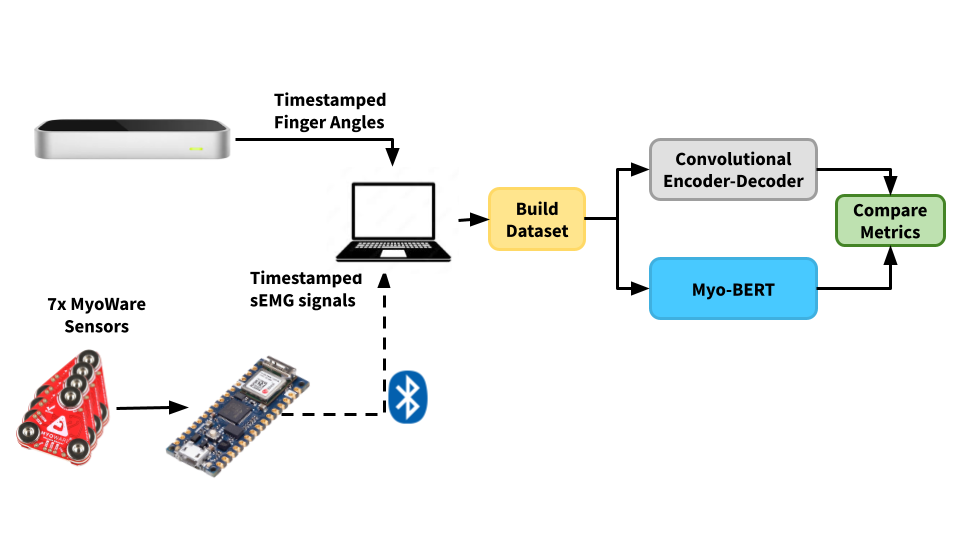

At the high-level, MyoPose's system is designed as above.

### Hardware

<p align="center">
    
     
    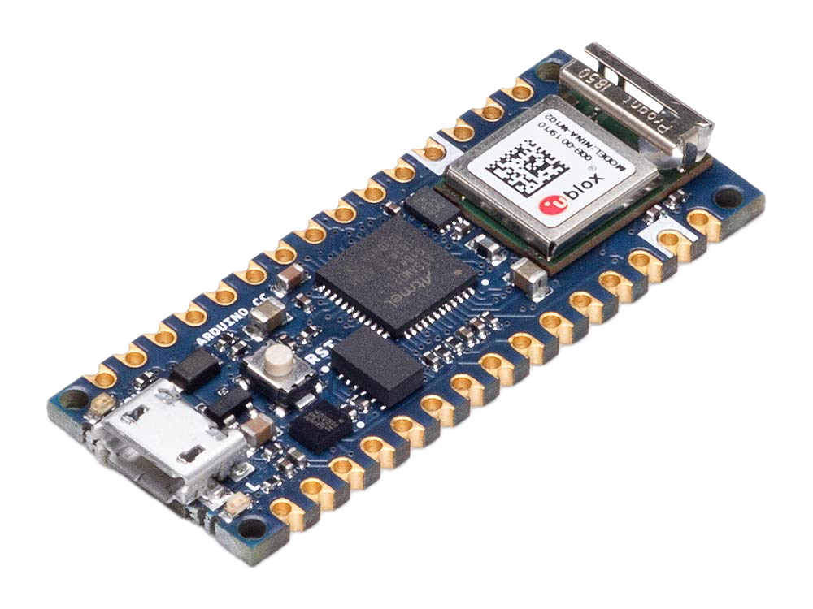 
</p>

The required hardware for MyoPose is:

- 7 [MyoWare Muscle Sensor 2.0's](https://www.sparkfun.com/products/21265)
- 7 [MyoWare 2.0 Cable Shields](https://www.sparkfun.com/products/18386)
- 7 [Sensor Cables](https://www.sparkfun.com/products/12970)
- 1 [Ultraleap motion controller](https://leap2.ultraleap.com/downloads/leap-motion-controller/)
    - currently deprecated. the alternative is the [ultraleap motion controller
      2.0](https://leap2.ultraleap.com/products/leap-motion-controller-2/)
- 1 [Arduino Nano 33 IoT](https://docs.arduino.cc/hardware/nano-33-iot/)
- At least 21 [24mm Disposable Surface EMG Electrodes](https://www.sparkfun.com/products/12969)

This above hardware is connected to a breadboard as shown below. 

<!-- TODO Make wiring diagram instead of breadboard picture -->
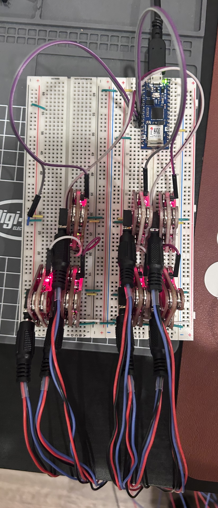
 
The setup uses 7 sensors with the 8th analog input wired to ground. Myo0
is on the lower right hand side of the breadboard and is connected to `A0` on
the Arduino Nano 33 IoT. Myo1 is to its left (connected to `A1`), and Myo4 is
above it in the image. Finally, `A_REF` is connected to ground to set the
Arduino's ADC reference voltage.

The leap motion sensor is simply plugged into the computer and laid on the desk
with the power cable to the left. 


### Electrode Placement

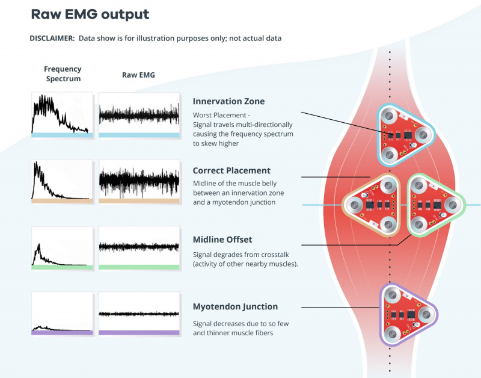

The MyoWare muscle sensors are very sensitive to electrode placement [[CITE]()].As such, accurate and consistent electrode placement is a must. If the electrodes are too close to the tendon or off-center of the muscle, the amplitude of the readings will be very small. If the electrodes are placed near the innveration zone (the area where the motor neurons connect with the muscle), signals from surronding muscles will cause a noisy signal.

#### Anterior Forearm 

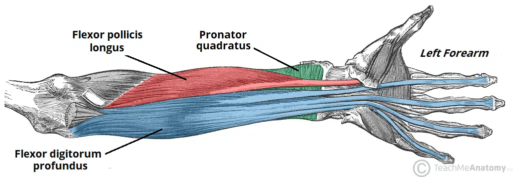

**Myo0** will go on the anterior (inside of) forearm on the flexor digitorum superficialis. This muscle is on the right side of the left forearm with the palm facing up in the intermediate region and is responsible for the flexion of the 4 fingers. To place the electrodes, press your right hand fingers against the muscle and move your left hand fingers individually. Place the red cable electrode at the point of the largest change in feeling when you flex your middle finger and place the blue cable electrode behind it. Finally, place the black reference electrode on a different muscle group or in a boney part of the elbow.

**Myo1** will be placed on the Flexor Pollicis Longus, which is in the deep compartment under the muscle responsible for flexing the elbow, the Brachioradialis [[CITE]()]. This muscle is responsible for the flexion of the thumb. Here we will use the same strategy, but curl the thumb towards the palm taking care to not move the thumb in the plane of the palm. 

**Myo2** will be placed on outer side of the Flexor Pollicis Longus to measure the abduction and adduction of the thumb. Place the electrode where the muscle is most activated when you move the thumb back and forth in the plane of the palm. 

**Myo3** will go about 1cm to the right of Myo0 to measure the outer side of the flexor digitorum profundus. Through experiments I found that this muscle cannot be accurately measured with 1 MyoWare muscle sensor. Myo3 will help specifically with the flexion of the ring and little finger.

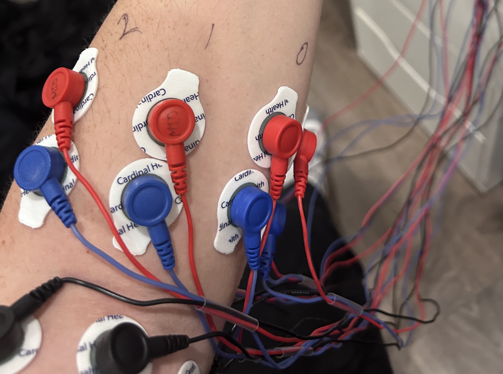

#### Posterior Forearm 

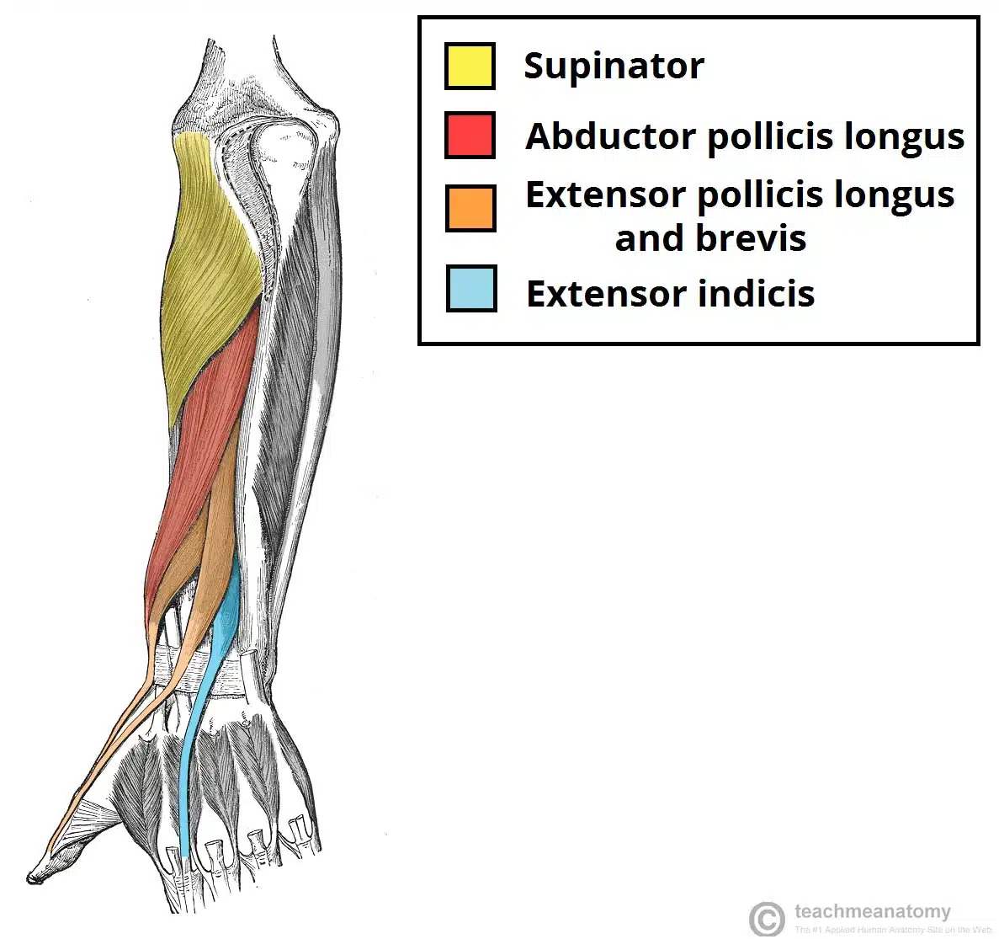

**Myo4** will go on the abductor pollicis longus a couple centimeters closer to the hand than the anterior electrodes. This muscle is responsible for the abduction of the thumb and rests just above the extensor indicis (the muscle that allows the index finger to move independently), and the extensor pollicis longus and brevis (the muscle for extending the thumb). Since this electrode measures 3 different muscles, there are complex interdependencies that would be difficult to extract without machine learning techniques. In addition, the index finger is the most used finger in most people, so it is important to predict its position for a good user experience.

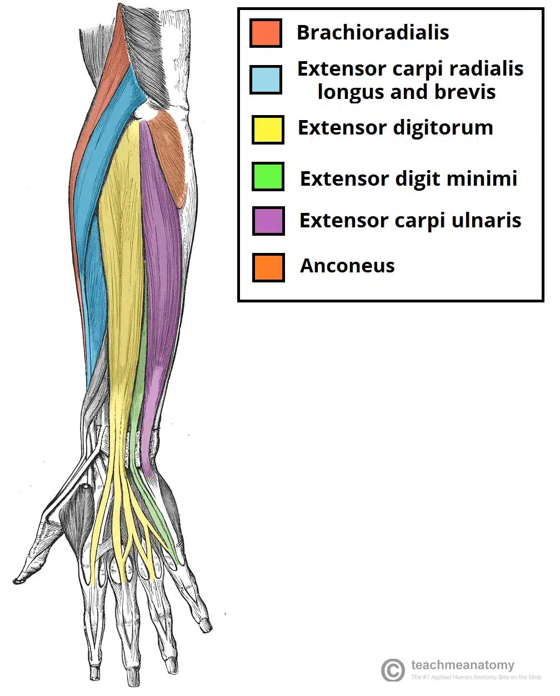

**Myo5** will go on the extensor digitorum closer to the middle of the forearm to avoid the extensor carpi radialis. The extensor digitorum is responsible for extending the fingers. 

**Myo6** will go just to the right of Myo5 to measure the extensor digitorum minimus. This is the muscle that gives the pinky independent movement and is below the extensor digitorum. 

**Myo7** will be wired to GND since I only had access to 7 MyoWare Sensors.

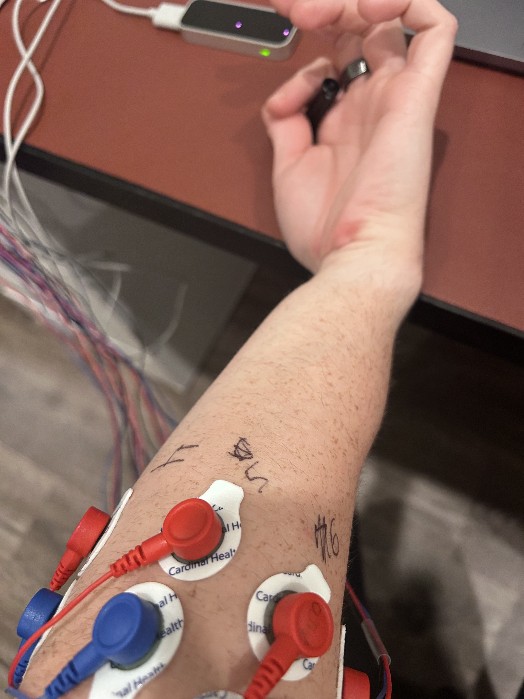


### Data Collection and Cleaning

At the high level, the arduino streams the sEMG data from the MyoWare sensors to my laptop with BLE. This is timestamped and aligned with the finger angle data from the Leap Motion Controller and cleaned up. It is then windowed into a sample window in the PyTorch dataset.

#### sEMG BLE Streamer

The BLE streamer uses the SenseML json format [[CITE]()] which is read by a Python script using the Bleak library [[CITE]()]. This data is timestamped and saved in a csv file of the format in [REFERENCE FILE HERE].

#### Finger Angle Logging

<p align="center">
    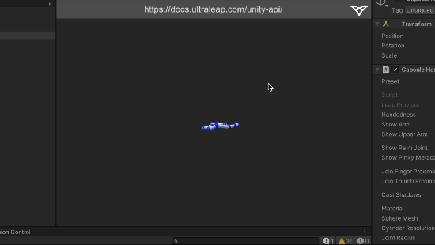
</p>

The Leap Motion Controller acts as the source of truth for our model by calculating and logging the euler angles of the joints of interest of the hand. The Leap Unity API [[CITE]()] exposes a function that gives the basis vectors of a bone from the base of the bone to the end of the bone. The joint angles can be calculated with this information. The mcp and thumb joints are a more complicated because they have multiple degrees of freedom at that joint. Therefore the basis vectors are projected onto an orthogonal plane to isolate the degrees of freedom before calculating the euler angles of the joint. 

#### Data Pre-processing

After the data is collected, the sEMG and Joint Angles are aligned according to their timestamps in 5ms samples, and the values of these samples are linearly interpolated. The sEMG data is the normalzed using the z-score:

$$
Z=\frac{x-\mu}{\sigma}
$$

Then we form windows of samples of `window_size` width at a stride, `stride`.
The windows from the multiple experiments are concatentated together and their order is randomized to homogenize the dataset.

### Autoencoder Implementation

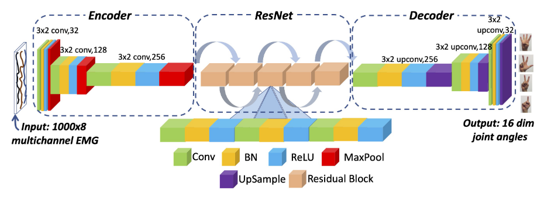

The NeuroPose Autoencoder will act as the baseline against the proposed transformer model. Since there is no public repo, we will implement it as closely as we can from the paper. The encoder consists of 3 consecutive blocks of `{Convolution, Batch Normalization, ReLU activation, and MaxPool Layers}`. 
The encoder transforms a 5 second input window of shape `[Batch Size, 1, 1000, 8]` to a latent space of shape `[Batch Size, 256, 8, 2]`, which is then fed into a series of 5 residual blocks [[CITE]()]. 

Finally, the output of the ResNet is Decoded with 3 consecutive blocks of `{Convolution, Batch Normalization, ReLU Activation, Upsample Layer}`. The output shape of the decoder is `[Batch Size, 1, 16, 1000]`. As such, the model converts each row of the 8 channel sEMG window to the 16 finger angles for every sample of the 5 second window (1000 samples in total).

#### Applying Hand Skeletal Constraints

One of the main contributions of NeuroPose was to lower the seach space for
their model by applying constraints dictated by a hand skeletal model
[[CITE]()]. This also allows the output dimension of the model to shrink from 21 to 16
since some joint angles can be directly calculated from others. Each of the four
finger $mcp,aa$, $mcp,f/e$, and $pip$ joints are constrained, according to the
skeletal model [[CITE]()]. A small addition that I made that I found to improve
performance was to perform min-max normalization to the thumb joint angles.
**TODO: Show this in evaluation plots**

#### Custom Loss Function

$$
loss_{mcp,f/e} = \sum_{n=1}^{4} (\hat{\theta}_{i,mcp,f/e} - \theta_{i,mcp,f/e})^2
$$

$$
loss_{pip} = \sum_{n=1}^{4} (\hat{\theta}_{i,pip} - \theta_{i,pip})^2
$$

$$
loss_{mcp,aa} = \sum_{n=1}^{4} (\hat{\theta}_{i,mcp,aa} - \theta_{i,mcp,aa})^2
$$

$$
loss_{thumb} = (\hat{\theta}_{th,mcp,aa} - \theta_{th,mcp,aa})^2 + \newline
(\hat{\theta}_{th,mcp,f/e} - \theta_{th,mcp,f/e})^2 + (\hat{\theta}_{tm,tm,aa} - \theta_{tm,tm,aa})^2 + \newline
(\hat{\theta}_{th,tm,f/e} - \theta_{th,tm,f/e})^2
$$

> **Note:** [[CITE]()] has what I assume is a typo in the last term of
$loss_{thumb}$. It has the last term as $(\hat{\theta}_{th,tm,f/e} -
*\theta_{th,mcp,f/e})^2$, which would not make sense.

$$
loss_{smoothness} = \| \nabla\hat{\theta_t} - \nabla\hat{\theta}_{t-1}\|_2^2
$$


The overall loss is therefore:

$$
loss = loss_{mcp,f/e} + loss_{mcp,aa} + \newline
loss_{pip} + loss_{thumb} + loss_{smoothness}
$$

This custom loss is implemented as a `nn.Module` as shown below:

```python
class NeuroPoseLoss(nn.Module):
  def __init__(self):
    super(NeuroPoseLoss, self).__init__()

  def forward(self, output, target):
    mcp_aa_inds = [4, 7, 10, 13]
    mcp_flex_inds = [5, 8, 11, 14]
    pip_inds = [6, 9, 12, 15]
  
    loss_mcp_aa = 0
    for i in mcp_aa_inds:
      loss_mcp_aa += torch.pow((output[:,:,:,i] - target[:,:,:,i]), 2)
    loss_mcp_aa = torch.mean(loss_mcp_aa)
  
    loss_mcp_fe = 0
    for i in mcp_flex_inds:
      loss_mcp_fe += torch.pow((output[:,:,:,i] - target[:,:,:,i]), 2) 
    loss_mcp_fe = torch.mean(loss_mcp_fe)
  
    loss_pip_fe = 0
    for i in pip_inds:
      loss_pip_fe += torch.pow((output[:,:,:,i] - target[:,:,:,i]), 2) 
    loss_pip_fe = torch.mean(loss_pip_fe)
  
    loss_thumb_tm_aa = torch.mean(torch.pow(output[:,:,:,0] - target[:,:,:,0], 2))
    loss_thumb_tm_fe = torch.mean(torch.pow(output[:,:,:,1] - target[:,:,:,1], 2))
    loss_thumb_mcp_aa = torch.mean(torch.pow(output[:,:,:,2] - target[:,:,:,2], 2))
    loss_thumb_mcp_fe = torch.mean(torch.pow(output[:,:,:,3] - target[:,:,:,3], 2))
    loss_thumb = loss_thumb_mcp_aa + loss_thumb_mcp_fe + loss_thumb_tm_aa + loss_thumb_tm_fe

  
    # TODO: Figure out how to do this
    # loss_smoothness = output.grad - prev_output.grad
    loss_smoothness = 0
  
    loss = torch.mean(loss_mcp_aa + loss_mcp_fe + loss_pip_fe + loss_thumb + loss_smoothness)
  
    return loss
```


### Myo-BERT Transformer Implementation

Myo-BERT is based off of LIMU-BERT [[CITE]()] and ViT [[CITE]()] models. 

## 4. Evaluation and Results

### Data Collection Methodology

The data collection method closely follows [[CITE]()]'s approach and is as follows:
<!-- TODO: Reference electrode placement section in line below -->
1. Connect the electrodes as stated above in []()
2. Run the data collection scripts for the MyoPose hardware and the Leap Motion Tracker
3. Move the fingers above the motion sensor randomly for 90 seconds
4. Repeat 10 times for each experiment configuration 
5. Run the `csv_cleaner.py` script for the collected data
6. Use the "clean" csv data for the PyTorch dataset

I collected data using both the enveloped (ENV) and the rectified (RECT) sEMG data from the MyoWare muscle sensors. 

<!-- TODO: Talk about pytorch dataset stuffs here -->

### Autoencoder Evaluation

The autoencoder implementation of MyoPose was evaluated against itself in various setups the stated joint errors per finger from [[CITE]()].

The evaluated model configurations are as follows:

#### Rectified vs. Enveloped sEMG Data

<figure>
    <p align="center">
        
        <figcaption align="center"> (a) </figcaption>
        
        <figcaption align="center"> (a) </figcaption>
    </p>
    <figcaption align="center">Fig _. </figcaption>
</figure>

As you can see from the loss plots, the ENV data has a lower final loss than the RECT data. However, the joint angle error in degrees is not significantly different. For the rest of the experiments, I will use the ENV data since it is easier to see in the time domain plots and performs sligtly better.

#### With and Without Hand Skeletal Constraints 

bleh

This experiement shows that the hand skeletal constraints from NeuroPose are necessary to get a decent result from the Autoencoder model. The accuracy of the model significantly improves accross all joint angles.

#### bleh

bleh


### Transformer Evaluation


## 5. Discussion and Conclusions

It is clear that MyoPose cannot match NeuroPose's accuracy in its current state. This is likely because of the inconsistent electrode placement, less accurate hardware, and interpolation method for building a consistently sampled dataset. Furthermore, the hardware is far too inconvienent for the user. There are too many wires to manage, and the electrodes leave a sticky residue after they are removed. However, I believe that there is promise in the overall design and with improved data collection and processing, the project can be a success.

There are many future directions I can take this project. Some ideas include:

- Design a miniaturized open source hardware implementation with dry electrodes like the MyoBand.
- Implement the MyoPose hardware in an RTOS to avoid the data interpolation step of the data processing pipeline. This would likely be a requirement to miniaturize the hardware because the smaller hardware would require much stricter power consumption constraints.
- Implement timestamping and time synchronization on MyoPose hardware. This would set the timestamps to be closer to the sEMG measurement since it doesn't have to wait for the laptop to receive the BLE packet and process it.
- Implement a Set Function for Time Series (SeFT) model [[CITE]()] or similar to avoid the need to do interpolation and resampling.

Overall, [SOMETHING SOMETHING LEARNINGS DONE]

## 6. References


https://github.com/hbldh/bleak


https://docs.ultraleap.com/api-reference/unity-api/api-reference.html