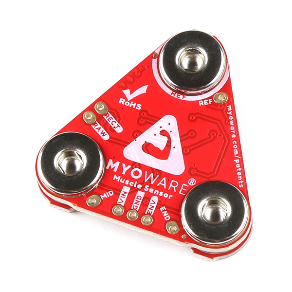

## Table of Contents
* [Abstract](#Abstract)
* [Introduction](#1-introduction)
* [Related Work](#2-related-work)
* [Technical Approach](#3-technical-approach)
* [Evaluation and Results](#4-evaluation-and-results)
* [Discussion and Conclusions](#5-discussion-and-conclusions)
* [References](#6-references)

## Abstract

Fine grained finger position tracking has many applications in healthcare,
extended reality (XR), and sports science. MyoPose uses hobby electronics to
read the muscle activation signals of the muscles in the forearm with surface
electromyograpgy (sEMG) and predict the angle of the joints of the fingers using
novel machine learning architectures. MyoPose includes two models: one based on
an autoencoder, commonly used for vision tasks, and Myo-BERT, a model based on
LIMU-BERT, a transformer-based models intended for use with inertial measurment
unit (IMU) data. MyoPose and Myo-BERT are within $$7.5^\circ$$ median accuracy
other solutions with consumer grade hardware with a smaller amount of training
data and sample window size.

## 1. Introduction

### 1.1 Motivation & Objective

Extended reality (XR) has recently driven innovation in human computer
interfaces, especially in measuring the position of the fingers on the hand.
This fine-grained finger position tracking is usually done with computer vision
as in the Meta Quest 3 [[4](#6-references)]. However, vision-based finger tracking relies
on the hand being in view of the camera. As a result, alternative finger
posetracking have been proposed such as wristpressure [[5](#6-references)],
bioimpedence [[6](#6-references)], and mmWave technology [[7](#6-references)]. One of the
most promising technologies is surface Electromyography (sEMG) that has even
been demoed in Meta's recent Orion augmented reality (AR) glasses anouncement
that included a sEMG wristband to track certain gestures [[3](#6-references)]. 

MyoPose creates an open source framework to measure the
position of the fingers of the hand for fine-grained hand pose tracking using
sEMG. It uses a neural network that encodes spatial-temporal information with
attention mechanisms to predict complex finger positions based on sEMG signals.

### 1.2 State of the Art & Its Limitations

In 2021, researchers out of Penn State published a paper where they used a
consumer sEMG wearable to track the finger position of the user with a
convolutional encoder-decoder architecture on a smartphone that they called
NeuroPose [[1](#6-references)]. However, the convolutional autoencoder architecture does not
encode the spatial-temporal information in the architecture of the model. As a
result, they had to feed 5s worth of data for each prediction. Furthermore, the
device consumer device, the Myoband [[8](#6-references)], is
no longer on the market because the company was bought by Meta [[9](#6-references)].
Currently there is no developer friendly, fully integrated sEMG alternative
to the Myoband, so research in this field has stagnated and has been siloed
in industry.

In addition, the authors of NeuroPose did not release their source code for public use. 
Although they attempted to use a RNN to capture the spatial temporal information
in the model, it did not perform as well as the autoencoder. With the recent
advancements of neural network architectures for time-domain sensor data like
LIMU-Bert [[2](#6-references)], I expect to see improved performance of the model compared
to the baseline convolutional encoder-decoder architecture.

### 1.3 Novelty & Rationale

My goal is to provide an open source framework for finger pose detection
building on the work of NeuroPose with added features and using available hobby
grade sEMG hardware, the MyoWare Muscle Sensor 2.0 [[11](#6-references)]. MyoPose 
implements an autoencoder model and evaluates state of the art (SotA) model architectures 
such as LIMU-Bert [[2](#6-references)].

I expected to see that architectures that encode spatial-temporal information
through attention would need smaller windows sizes and have real-time potential
on mobile devices.

### 1.4 Potential Impact

sEMG finger pose detection is a promising idea with many applitcations such as
healthcare [[13](#6-references)], advanced prosthetics [[14](#6-references)], 
and XR interaction [[3](#6-references)]. A mature implementation of MyoPose can enable 
greater XR immersion and a groundwork for returning amputees' control of their 
prosthetics. Furthermore, if MyoPose is successful, it will create a framework
for the open source community to contribute to these fields. More open source 
development will accelerate innovation by democratizing contributions.

### 1.5 Challenges

There are many challenges with MyoPose. sEMG signals are dependent on many
things including electrode placement, muscle sensor gain, hardware
variabilities, and more. In addition, the ground truth relies on the Ultraleap
Motion Controller depth sensor [[12](#6-references)] which is not 100% accurate
and can lose ha tracking.

Another challenge is that it is difficult to generate a dataset that is
consistent between days and placements of the electrodes. Since the MyoWare
Muscle Sensor 2.0's electrode placement is up to the user, there can be small
differences between the distances between the electrodes, which will have a very
large effect on the output amplitudes.

### 1.6 Requirements for Success

The required hardware and software are as follows. If you plan to replicate
MyoPose on your own, I would reccomend having proficiency with the libraries and
software used and the following hardware.

#### 1.6.1 Hardware

    
     
     

    <b>
        Fig 1. Main hardware required. Left: MyoWare Muscle Sensor 2.0. Middle:
        Leap Motion Controller. Right: Arduino Nano 33 IoT
    </b>

The required hardware for MyoPose is:

- 7 [MyoWare Muscle Sensor 2.0's](https://www.sparkfun.com/products/21265)
- 7 [MyoWare 2.0 Cable Shields](https://www.sparkfun.com/products/18386)
- 7 [Sensor Cables](https://www.sparkfun.com/products/12970)
- 1 [Ultraleap motion controller](https://leap2.ultraleap.com/downloads/leap-motion-controller/)
    - currently deprecated. the alternative is the [ultraleap motion controller
      2.0](https://leap2.ultraleap.com/products/leap-motion-controller-2/)
- 1 [Arduino Nano 33 IoT](https://docs.arduino.cc/hardware/nano-33-iot/)
- At least 21 [24mm Disposable Surface EMG Electrodes](https://www.sparkfun.com/products/12969)
    - For a 7 MyoPose setup, you will need 21 electrodes per experiment. You can
    reuse the electrodes for the same person a few times, but the electrode gel
    will degrade and the data quality will lower. Don't use electodes between
    subjects. That is just icky.

This above hardware is connected to a breadboard as shown below. 

<!-- TODO Make wiring diagram instead of breadboard picture -->

    

    <b>
        Fig 2. Breadboard wiring of MyoPose in the RECT configuration.
    </b>

 
The setup uses 7 sensors with the 8th analog input wired to ground. Myo0
is on the lower right hand side of the breadboard and is connected to `A0` on
the Arduino Nano 33 IoT. Myo1 is to its left (connected to `A1`), and Myo4 is
above it in the image. Finally, `A_REF` is connected to ground to set the
Arduino's ADC reference voltage.

The leap motion sensor is simply plugged into the computer and laid on the desk
with the power cable to the left. 

#### 1.6.2 Software 

- Arduino C++ programming
- Python programming
    - [Bleak BLE Library]()
    - [pandas]()
- Profiency with machine learning frameworks such as
  [PyTorch](https://pytorch.org/)
- Unity C# for Ultraleap ground truth tracking

### 1.7 Metrics of Success

MyoPose should be able to be 90% accurate to the chosen source of ground truth
with low latency (<100ms) using a M2 Pro Macbook Pro. In addition, MyoPose's
novel transformer-based model should perform equally or better than the baseline
autoencoder implementation. Finally, MyoPose should be robust to small electrode
repositioning and changes in arm position. 

If time permits, I would like to compress the model to be able to be run on a
smartphone and evaluate the loss of accuracy and compare the power draw between
models.

## 2. Related Work

**NeuroPose: 3D Hand Pose Tracking using EMG Wearables:** [[1](#6-references)]
This is the main paper that I am referencing for the methodologies of creating
the dataset from the Ultraleap motion controller and the baseline architecture
for the neural network. The main differences between MyoPose and NeuroPose is 
that it uses different sEMG hardware and experiements with novel machine
learning architectures.

**LIMU-BERT: Unleashing the Potential of Unlabeled Data for IMU Sensing Applications:** [[2](#6-references)] 
LIMU-BERT is an architecture and pretraining methodology for time domain IMU
data. This data has low dimensionality and is heavily time dependent, which is
very similary to the sEMG data of MyoPose. The researchers used self-supervised
learning method to pretrain the LIMU-BERT model, then attached a classifier head
to perform HAR (Human Activity Recognition) classification from the IMU data.

**An Image is Worth 16x16 Words: Transformers for Image Recognition at Scale:** [[11](#6-references)]
ViT is one of the first papers to effectively use attention mechanisms on
images. They did this by spliting the image in patches, flattening, and
performing positional encoding before inputing it into the model. In addition,
ViT prepends a $$CLS$$ token that encodes the information from the rest of the
tokens into its value. Everything but the $$CLS$$ token is discarded and the
$$CLS$$ token is used an input to a MLP (Muli-Layer Perceptron) classifier head.
It was also noted that they only saw improvements from the tranditional
convolutional models after a long time training, which they propose may be the
model taking the time to understand the spatial relationships between the image
patches.

## 3. Technical Approach

    <b>
        Fig 3. High level systems block diagram of MyoPose .
    </b>

At the high-level, MyoPose's system is designed as above.

### 3.1 Electrode Placement

    

    <b>
        Fig 4. Electrode placement infographic. Note the innervation zones and
        the midline offset positions. Some electrodes may be places in the
        midline offset positions, but it is critical to have no electrode
        measuring the innervation zone. 
    </b>

The MyoWare muscle sensors are very sensitive to electrode placement
[[10](#6-references)].As such, accurate and consistent electrode placement is a
must. If the electrodes are too close to the tendon or off-center of the muscle,
the amplitude of the readings will be very small. If the electrodes are placed
near the innveration zone (the area where the motor neurons connect with the
muscle), signals from surronding muscles will cause a noisy signal.

#### 3.1.1 Anterior Forearm 

    

    <b>
        Fig 5. Diagram of anterior forearm's deep compartment.
    </b>

**Myo0** will go on the anterior (inside of) forearm on the flexor digitorum
superficialis. This muscle is on the right side of the left forearm with the
palm facing up in the intermediate region and is responsible for the flexion of
the 4 fingers [[18](#6-references)]. To place the electrodes, press your right
hand fingers against the muscle and move your left hand fingers individually.
Place the red cable electrode at the point of the largest change in feeling
when you flex your middle finger and place the blue cable electrode behind it.
Finally, place the black reference electrode on a different muscle group or in
a boney part of the elbow.

**Myo1** will be placed on the Flexor Pollicis Longus, which is in the deep
compartment under the muscle responsible for flexing the elbow, the
Brachioradialis [[18](#6-references)]. This muscle is responsible for the
flexion of the thumb. Here we will use the same strategy, but curl the thumb
towards the palm taking care to not move the thumb in the plane of the palm. 

**Myo2** will be placed on outer side of the Flexor Pollicis Longus to measure
the abduction and adduction of the thumb [[18](#6-references)]. Place the
electrode where the muscle is most activated when you move the thumb back and
forth in the plane of the palm. 

**Myo3** will go about 1cm to the right of Myo0 to measure the outer side of the
flexor digitorum profundus. Through experiments I found that this muscle cannot
be accurately measured with 1 MyoWare muscle sensor. Myo3 will help
specifically with the flexion of the ring and little finger
[[18](#6-references)].

    

    <b>
        Fig 6. Electrodes placed and numbered on anterior forearm.
    </b>

#### 3.1.2 Posterior Forearm 

 
    <figure class = "half-width"> 
        
        <figcaption align="center"><b>(a)</b></figcaption> 
    </figure> 
    <figure class = "half-width"> 
        
        <figcaption align="center"><b>(b)</b></figcaption> 
    </figure> 

 

    <b>
        Fig 7. Diagrams of posterior forearm muscles. (a) superficial compartment (b) deep compartment.
    </b>

**Myo4** will go on the abductor pollicis longus a couple centimeters closer to
the hand than the anterior electrodes. This muscle is responsible for the
abduction of the thumb and rests just above the extensor indicis (the muscle
that allows the index finger to move independently), and the extensor pollicis
longus and brevis (the muscle for extending the thumb) [[17](#6-references)].
Since this electrode measures 3 different muscles, there are complex
interdependencies that would be difficult to extract without machine learning
techniques. In addition, the index finger is the most used finger in most
people, so it is important to predict its position for a good user experience.

**Myo5** will go on the extensor digitorum closer to the middle of the forearm
to avoid the extensor carpi radialis. The extensor digitorum is responsible for
extending the fingers [[18](#6-references)]. 

**Myo6** will go just to the right of Myo5 to measure the extensor digitorum
minimus. This is the muscle that gives the pinky independent movement and is 
below the extensor digitorum [[18](#6-references)]. 

**Myo7** will be wired to GND since I only had access to 7 MyoWare Sensors.

    

    <b>
        Fig 8. Electrodes placed and numbered on posterior forearm.
    </b>

### 3.2 Data Collection and Cleaning

At the high level, the arduino streams the sEMG data from the MyoWare sensors to
my laptop with BLE. This is timestamped and aligned with the finger angle data
from the Leap Motion Controller and cleaned up. It is then windowed into a
sample window in the PyTorch dataset.

#### 3.2.1 sEMG BLE Streamer

The BLE streamer uses the SenseML json format [[22](#6-references)] which is read by a
Python script using the Bleak library [[20](#6-references)]. This data is timestamped and
saved in a csv file.

#### 3.2.2 Finger Angle Logging

    

    <b>
        Fig 9. Left hand tracking using Leap Motion Controller and Unity.
    </b>

The Leap Motion Controller acts as the source of truth for our model by
calculating and logging the euler angles of the joints of interest of the hand.
The Leap Unity API [[21](#6-references)] exposes a function that gives the basis
vectors of a bone from the base of the bone to the end of the bone. The joint
angles can be calculated with this information. The mcp and thumb joints are a
more complicated because they have multiple degrees of freedom at that joint.
Therefore the basis vectors are projected onto an orthogonal plane to isolate
the degrees of freedom before calculating the euler angles of the joint. 

#### 3.2.3 Data Pre-processing

After the data is collected, the sEMG and Joint Angles are aligned according to
their timestamps in 5ms samples, and the values of these samples are linearly
interpolated. The sEMG data is the normalzed using the z-score:

$$
Z=\frac{x-\mu}{\sigma}
$$

Then we form windows of samples of `window_size` width at a stride, `stride`.
The windows from the multiple experiments are concatentated together and their
order is randomized to homogenize the dataset.

### 3.3 Autoencoder Implementation

    <b>
        Fig 10. Autoencoder architecture used in NeuroPose and MyoPose.
    </b>

The NeuroPose Autoencoder will act as the baseline against the proposed
transformer model. Since there is no public repo, we will implement it as
closely as we can from the paper. The encoder consists of 3 consecutive blocks
of `{Convolution, Batch Normalization, ReLU activation, and MaxPool Layers}`.
The encoder transforms a 5 second input window of shape `[Batch Size, 1, 1000,
8]` to a latent space of shape `[Batch Size, 256, 8, 2]`, which is then fed into
a series of 5 residual blocks [[1](#6-references)]. 

Finally, the output of the ResNet is Decoded with 3 consecutive blocks of
`{Convolution, Batch Normalization, ReLU Activation, Upsample Layer}`. The
output shape of the decoder is `[Batch Size, 1, 16, 1000]`. As such, the model
converts each row of the 8 channel sEMG window to the 16 finger angles for every
sample of the 5 second window (1000 samples in total).

#### 3.3.1 Applying Hand Skeletal Constraints

One of the main contributions of NeuroPose was to lower the seach space for
their model by applying constraints dictated by a hand skeletal model
[[1](#6-references)]. This also allows the output dimension of the model to shrink from 21 to 16
since some joint angles can be directly calculated from others. Each of the four
finger $$mcp,aa$$, $$mcp,f/e$$, and $$pip$$ joints are constrained, according to the
skeletal model [[1](#6-references)]. A small addition that I made that I found to improve
performance was to perform min-max normalization to the thumb joint angles.

#### 3.3.2 Custom Loss Function

Another significant contribution of [[1](#6-references)] was the custom loss
function that is shown through the equations below.

| - | - |
| $$ loss_{mcp,f/e} = \sum_{n=1}^{4} (\hat{\theta}_{i,mcp,f/e} - \theta_{i,mcp,f/e})^2$$ | $$loss_{pip} = \sum_{n=1}^{4} (\hat{\theta}_{i,pip} - \theta_{i,pip})^2$$ |
| $$loss_{mcp,aa} = \sum_{n=1}^{4} (\hat{\theta}_{i,mcp,aa} - \theta_{i,mcp,aa})^2$$ | $$loss_{smoothness} = \|\nabla\hat{\theta_t} - \nabla\hat{\theta}_{t-1}\|_2^2$$ | 

$$
loss_{thumb} = (\hat{\theta}_{th,mcp,aa} - \theta_{th,mcp,aa})^2 + \newline
(\hat{\theta}_{th,mcp,f/e} - \theta_{th,mcp,f/e})^2 + (\hat{\theta}_{tm,tm,aa} - \theta_{tm,tm,aa})^2 + \newline
(\hat{\theta}_{th,tm,f/e} - \theta_{th,tm,f/e})^2
$$

> **Note:** [[1](#6-references)] has what I assume is a typo in the last term of
$$loss_{thumb}$$. It has the last term as $$(\hat{\theta}_{th,tm,f/e} -
*\theta_{th,mcp,f/e})^2$$, which would not make sense.

The overall loss is therefore:

$$
loss = loss_{mcp,f/e} + loss_{mcp,aa} + \newline
loss_{pip} + loss_{thumb} + loss_{smoothness}
$$

This loss function essentially takes the MSE (mean squared error) loss of each
of the joint angles and adds a smoothness term to discourage large jumps in
finger angles between predictions.

### 3.4 Myo-BERT Transformer Implementation

 
    <figure class = "half-width"> 
        
        <figcaption align="center"><b>(a)</b></figcaption> 
    </figure> 
    <figure class = "half-width"> 
         
        <figcaption align="center"><b>(b)</b></figcaption> 
    </figure> 

 

    <b>
        Fig 11. Myo-BERT model architecture. (a) High level block diagram. (b)
        LIMU-BERT encoder block used in Myo-BERT
    </b>

Myo-BERT is based off of LIMU-BERT [[2](#6-references)] and ViT
[[11](#6-references)] models. It finetunes from the pretrained weights from
LIMU-BERT and originally intendede to use the $$CLS$$ token method from
[[11](#6-references)]. Instead of a classifier head, the plan was to use a
"regression head". 

After experimentation, it was clear that it would be more effective to use all
output tokens as the input to the regression head. I tested two types of
regression heads: an attention-based model and a simple MLP (Multi-Layered
Perceptron). 

## 4. Evaluation and Results

### 4.1 Data Collection Methodology

The data collection method closely follows [[1](#6-references)]'s approach and is as follows:
<!-- TODO: Reference electrode placement section in line below -->
1. Connect the electrodes as stated above in 
2. Run the data collection scripts for the MyoPose hardware and the Leap Motion Tracker
3. Move the fingers above the motion sensor randomly for 90 seconds
4. Repeat 10 times for each experiment configuration 
5. Run the `csv_cleaner.py` script for the collected data
6. Use the "clean" csv data for the PyTorch dataset

I collected data using both the enveloped (ENV) and the rectified (RECT) sEMG
data from the MyoWare muscle sensors (see [Sec. 4.2.3](#423-comparison-vs-neuropose-stated-results)).

### 4.2 Autoencoder Evaluation

The autoencoder implementation of MyoPose was evaluated against itself in various setups the stated joint errors per finger from [[1](#6-references)].

The evaluated model configurations are as follows:

#### 4.2.1 Rectified vs. Enveloped sEMG Data

 
    <figure class = "half-width"> 
        
        <figcaption align="center"><b>(a)</b></figcaption> 
    </figure> 
    <figure class = "half-width"> 
        
        <figcaption align="center"><b>(b)</b></figcaption> 
    </figure> 

 

 
    <figure class = "half-width"> 
        
        <figcaption align="center"><b>(c)</b></figcaption> 
    </figure> 
    <figure class = "half-width"> 
        
        <figcaption align="center"><b>(d)</b></figcaption> 
    </figure> 

 

    <b>
        Fig 12. Evaluation results between RECT and ENV MyoWare filtering
        methods. (a) The joint angle errors in degrees with RECT filtering.  (c)
        A random 5 second sample of z-score normalized RECT data.  (b) The error
        with ENV filtering. (d) A random 5 second sample of z-score normalized
        ENV data. 
    </b>

The joint angle error in degrees is not significantly different different
between the RECT and ENV data. The thumb $$mcp,f/e$$ and $$mcp,aa$$ joints seem
to perform slighly worse with the ENV filtering. However, the median degrees of
error is smaller for the ENV data collection. For the rest of the experiments, I
will use the ENV data since it is easier to see clear signals in the time domain
plots and has a slightly smaller median error.

#### 4.2.2 With and Without Hand Skeletal Constraints 

 
    <figure class = "half-width"> 
        
        <figcaption align="center"><b>(a)</b></figcaption> 
    </figure> 
    <figure class = "half-width"> 
        
        <figcaption align="center"><b>(b)</b></figcaption> 
    </figure> 

 

 
    <figure class = "half-width"> 
        
        <figcaption align="center"><b>(c)</b></figcaption> 
    </figure> 
    <figure class = "half-width"> 
        
        <figcaption align="center"><b>(d)</b></figcaption> 
    </figure> 

 

    <b>
        Fig 13. Comparison between MyoPose with and without hand skeletal
        constraints. (a) Loss plot of no constraint MyoPose model. (b) Loss plot
        of constraint normalized model. (c) Joint error in degrees for no
        constraint model. (d) Joint error in degrees for constrained MyoPose
        model.
    </b> 

This experiement shows that the hand skeletal constraints from NeuroPose are
necessary to get a decent result from the Autoencoder model. Without applying
the constraints, it seems like the model doesn't train. In addition, the
accuracy of the model significantly improves accross all joint angles. It is
worth noting that the $$mcp,aa$$ joints seem to have the smallest error. This
because it has the tightest skeletal constraint, so the maximum error is at most
$$30^\circ$$, which the autoencoder handily outperforms.

#### 4.2.3 Comparison vs Neuropose Stated Results

<figure align="center">
    
</figure>

    <b>
        Fig 14. Finger error in degrees for MyoPose and NeuroPose autoencoder
        implementations. The whiskers represent the 90% percentile error bars,
        and the box size represents the quartiles.
    </b> 

MyoPose's autoencoder implementation does not meet the stated results from
[[1](#6-references)]. This is likely because the hobby grade hardware of MyoPose
is not as robust to changes in electrode placement between experiements. Without
the deprecated MyoBand, we will not be able to know for certain if this is the
case.

### 4.3 Transformer Evaluation

The transformer models were trained with a batch size of 32, Adam optimizer with
lr=0.001, and the custom loss. The transformer encoderers were initialized with
the LIMU-BERT weights and finetuned with the sEMG data of window size 250. I
compared between the attention head and MLP head and bewtween what index of the
window to set as the ground truth.

#### 4.3.1 Attention vs MLP Head

 
    <figure class = "half-width"> 
        
        <figcaption align="center"><b>(a)</b></figcaption> 
    </figure> 
    <figure class = "half-width"> 
        
        <figcaption align="center"><b>(b)</b></figcaption> 
    </figure> 

 

 
    <figure class = "half-width"> 
        
        <figcaption align="center"><b>(c)</b></figcaption> 
    </figure> 
    <figure class = "half-width"> 
        
        <figcaption align="center"><b>(d)</b></figcaption> 
    </figure> 

 

    <b>
        Fig 15. Comparison between Myo-BERT with attention and MLP regression
        heads. (a) Loss plot of Myo-BERT with attention head. (b) Loss plot of
        Myo-Bert with MLP head. (c) Joint error in degrees for Myo-BERT with
        attention head. (d) Joint erro in degrees for Myo-BERT with MLP head.
    </b> 

It seems that the added complexity of the attention head has an adverse effect
on the model training. The overall loss of the model is much higher than the MLP
head and it is not as numerically stable. With more time and GPU resources,
there may be promise to this head, but the MLP head seems to be the clear winner
in trainability and overall finger joint accuracy.

#### 4.3.2 Ground Truth Window Index

 
    <figure class = "half-width"> 
        
        <figcaption align="center"><b>(a)</b></figcaption> 
    </figure> 
    <figure class = "half-width"> 
        
        <figcaption align="center"><b>(b)</b></figcaption> 
    </figure> 

 

 
    <figure class = "half-width"> 
        
        <figcaption align="center"><b>(c)</b></figcaption> 
    </figure> 
    <figure class = "half-width"> 
        
        <figcaption align="center"><b>(d)</b></figcaption> 
    </figure> 

 

    <b>
        Fig 16. Comparison between Myo-BERT trained with the joint angles ground
        truth from the window index 0 (l0) and Myo-BERT trained with the joint
        angles ground truth from the center of the 250 sample window (l125). (a)
        Loss plot of Myo-BERT l0. (b) Loss plot of Myo-Bert l125. (c) Joint
        error in degrees for Myo-BERT l0. (d) Joint erro in degrees for Myo-BERT
        l125. 
    </b> 

When the output of the model is compared to the finger angle readings from the
middle of the window, the performance of training curve improves significantly.
This implies that the sEMG signals have information from before and after the
point of labeling from the Leap motion controller. However, it is also worth
noting that the joint error plots seem to indicate that the 0 index label
performs almost as good if not better for some of the joints. For example, the
$$thumb_{tm,flex}$$ joint performs much worse for the 125 indexed label model,
but the other thumb joints have slightly lower error. I am not sure why this is
the case and think that further investigation is necessary.

#### 4.3.3 Comparison vs Neuropose Stated Results

<figure align="center">
    
</figure>

    <b>
        Fig 17. Finger error in degrees for Myo-BERT and NeuroPose autoencoder
        implementations. The whiskers represent the 90% percentile error bars,
        and the box size represents the quartiles.
    </b> 

The final error from the Myo-BERT transformer implementation is closer to the
stated results from Neuropose autoencoder and significantly better than the
MyoPose autoencoder implementation. I believe there is promise to this
transformer implementation and it is worth further research. 

## 5. Discussion and Conclusions

It is clear that MyoPose cannot match NeuroPose's accuracy in its current state.
This is likely because of the inconsistent electrode placement, less accurate
hardware, and interpolation method for building a consistently sampled dataset.
Furthermore, the hardware is far too inconvienent for the user. There are too
many wires to manage, and the electrodes leave a sticky residue after they are
removed. However, I believe that there is promise in the overall design and with
improved data collection and processing, the project can be a success.

There are many future directions I can take this project. Some ideas include:

- Design a miniaturized open source hardware implementation with dry electrodes
like the MyoBand.
- Implement the MyoPose hardware in an RTOS to avoid the data interpolation step
of the data processing pipeline. This would likely be a requirement to
miniaturize the hardware because the smaller hardware would require much
stricter power consumption constraints.
- Implement timestamping and time synchronization on MyoPose hardware. This
would set the timestamps to be closer to the sEMG measurement since it doesn't
have to wait for the laptop to receive the BLE packet and process it.
- Implement a Set Function for Time Series (SeFT) model [[19](#6-references)] or
similar to avoid the need to do interpolation and resampling.

Overall, the transformer implementation based off of LIMU-BERT that I have
called Myo-BERT with a MLP regression head trained on the finger angles measured
in the center of the window performed the best and got the closest to
NeuroPose's stated accuracy. I learned a lot about this novel sensing modality
with wide applications and look forward to making improvements in the future. 

## 6. References

[1] Y. Liu, S. Zhang, and M. Gowda, “[NeuroPose: 3D Hand Pose Tracking using EMG
Wearables](https://doi.org/10.1145/3442381.3449890),” in Proceedings of the Web
Conference 2021, 2021, pp. 1471–1482. doi: 10.1145/3442381.3449890.

[2] H. Xu, P. Zhou, R. Tan, M. Li, and G. Shen, “[LIMU-BERT: Unleashing the
Potential of Unlabeled Data for IMU Sensing
Applications](https://dl.acm.org/doi/10.1145/3485730.3485937),” in Proceedings
of the 19th ACM Conference on Embedded Networked Sensor Systems, 2021, pp.
220–233. doi: 10.1145/3485730.3485937.

[3] “[Introducing Orion, our first true augmented reality
glasses](https://about.fb.com/news/2024/09/introducing-orion-our-first-true-augmented-reality-glasses/),”
Meta.

[4] "[Meta quest 3: New mixed reality VR
headset](https://www.meta.com/quest/quest-3)," Meta.

[5] Y. Zhang and C. Harrison, “[Tomo: Wearable, Low-Cost Electrical Impedance
Tomography for Hand Gesture
Recognition](https://dl.acm.org/doi/10.1145/2807442.2807480),” in Proceedings
of the 28th Annual ACM Symposium on User Interface Software & Technology, 2015,
pp. 167–173. doi: 10.1145/2807442.2807480.

[6] A. Dementyev and J. A. Paradiso, “[WristFlex: low-power gesture input with
wrist-worn pressure sensors](https://dl.acm.org/doi/10.1145/2642918.2647396),”
in Proceedings of the 27th Annual ACM Symposium on User Interface Software and
Technology, 2014, pp. 161–166. doi: 10.1145/2642918.2647396.

[7] Y. Liu, S. Zhang, M. Gowda, and S. Nelakuditi, “[Leveraging the Properties
of mmWave Signals for 3D Finger Motion Tracking for Interactive IoT
Applications](https://dl.acm.org/doi/10.1145/3570613),” Proc. ACM Meas. Anal.
Comput. Syst., vol. 6, no. 3, Dec. 2022, doi: 10.1145/3570613.

[8] B. Stern, “[Myo armband
teardown](https://learn.adafruit.com/myo-armband-teardown/inside-myo),”
Adafruit Learning System.

[9] N. Statt, “[Facebook acquires neural interface startup Ctrl-Labs for
its mind-reading
wristband](https://www.theverge.com/2019/9/23/20881032/facebook-ctrl-labs-acquisition-neural-interface-armband-ar-vr-deal),”
The Verge.

[10] “[MyoWare 2.0 Muscle Sensor](https://www.sparkfun.com/products/21265),”
SparkFun Electronics.

[11] A. Dosovitskiy et al., "[An Image is Worth 16x16 Words: Transformers for
Image Recognition at Scale](https://arxiv.org/abs/2010.11929)," 2021. 

[12] “[Leap Motion
Controller](https://leap2.ultraleap.com/downloads/leap-motion-controller/),”
Ultraleap. 

[13] . Song, H. Zeng, and D. Chen, “[Intuitive Environmental Perception
Assistance for Blind Amputees Using Spatial Audio
Rendering](https://ieeexplore.ieee.org/document/9693953),” IEEE Transactions
on Medical Robotics and Bionics, vol. 4, no. 1, pp. 274–284, 2022, doi:
10.1109/TMRB.2022.3146743.

[14] Y. Liu, S. Zhang, and M. Gowda, “[A Practical System for 3-D Hand Pose
Tracking Using EMG Wearables With Applications to Prosthetics and User
Interfaces](https://ieeexplore.ieee.org/abstract/document/9956792?casa_token=3dyoYAao0R0AAAAA:V7Y7o5BSo-O6iiTXpYZwePbNihNocsbR3mNIP8onyDL72KcI0Qk82rgn8z4RMQmxptrKXvRj9w),”
IEEE Internet of Things Journal, vol. 10, no. 4, pp. 3407–3427, 2023, doi:
10.1109/JIOT.2022.3223600.

[15] “[Unity real-time development platform](https://unity.com/),” Unity. 

[16] “[Pytorch Get Started](https://pytorch.org/),” PyTorch. 

[17] O. Jones, “[Muscles in the posterior compartment of the
forearm](https://teachmeanatomy.info/upper-limb/muscles/posterior-forearm/),”
TeachMeAnatomy. 

[18] O. Jones, “[Muscles in the anterior compartment of the
forearm](https://teachmeanatomy.info/upper-limb/muscles/anterior-forearm/),”
TeachMeAnatomy. 

[19] M. Horn, M. Moor, C. Bock, B. Rieck, and K. Borgwardt, "[Set Functions for
Time Series](https://arxiv.org/abs/1909.12064)". 2020. 

[20] Hbldh, “[HBLDH/Bleak: A cross platform bluetooth low energy client for
python using asyncio](https://github.com/hbldh/bleak),” GitHub.

[21] Leap Unity API Reference,
[https://docs.ultraleap.com/api-reference/unity-api/api-reference.html](https://docs.ultraleap.com/api-reference/unity-api/api-reference.html).

[22] C. Knorowski, “[Building a tinyml application with TF Micro and sensiml](https://blog.tensorflow.org/2021/05/building-tinyml-application-with-tf-micro-and-sensiml.html),” Building a TinyML Application with TF Micro and SensiML.